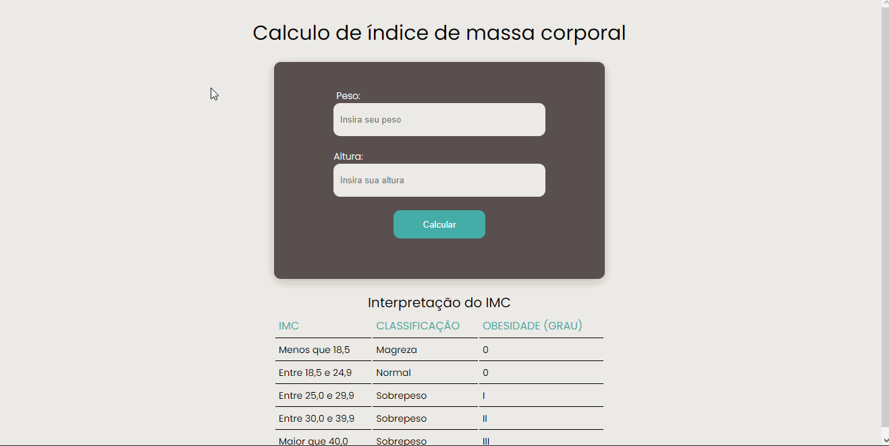

<h1 align="center">Calculadora de IMC</h1>
 
 

 

<h1> Sobre 🔖</h1>

 Calculadora de IMC com o objetivo de colocar em prática os estudos de JS.

<h1> Tecnologias Utilizadas 🚀</h1>

<h3>
 • <a href="https://developer.mozilla.org/pt-BR/docs/Web/HTML">HTML</a>  
 • <a href="https://developer.mozilla.org/pt-BR/docs/Web/CSS">CSS</a>  
 • <a href="https://developer.mozilla.org/pt-BR/docs/Web/JavaScript">JS</a>  
 
</h3>

